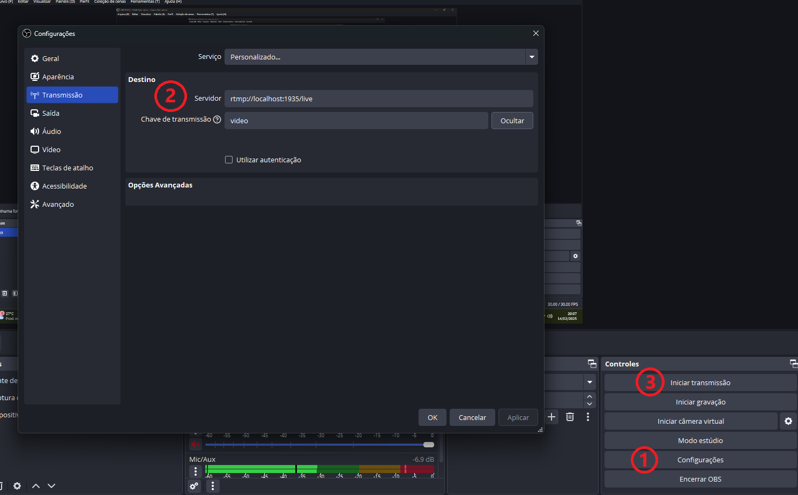

## Projeto de Streaming Local com NGINX, FFmpeg e HLS

Este projeto configura um servidor de streaming para vídeos locais utilizando NGINX com o módulo RTMP e FFmpeg. O objetivo é transmitir vídeos na rede interna via protocolo HTTP Live Streaming (HLS), permitindo acesso através de diferentes dispositivos na rede.

### Funcionalidades

- 📡 **Streaming Local**: Distribui arquivos de vídeo em formato `.m3u8` e `.ts` para reprodução via HLS.
- 🔄 **Conversão Automática**: Converte arquivos de vídeo (`.mkv`) para HLS automaticamente usando FFmpeg.
- ⏱️ **Configuração de Segmentos**: Define a duração dos segmentos de vídeo para otimizar a transmissão na rede local.
- 🌐 **Acesso pela Rede Interna**: Acessível através de dispositivos conectados na mesma rede Wi-Fi.

> **⚠️ Atenção:** Você pode utilizar um vídeo no formato MKV, ou então, utilizar diretamente o OBS Studio 31.0.1 de forma mais simples.

### Executando pelo método conversão MKV

#### Requisitos

- Docker
- Arquivo de vídeo: 'input.mkv'

**Clone o repositório**:
   ```bash
   git clone https://github.com/medowlucas/streaming-local-hls-nginx.git
   cd streaming-local-hls-nginx
   ```
**Inicie o projeto com o comando:**
   ```bash
   docker-compose up -d
   ```
**1. Insira um vídeo na pasta videos com o nome "input.mkv"**

**2. Converta o vídeo para stream utilizando o comando:**
   ```bash
   docker exec -it ffmpeg_converter sh -c "chmod +x /usr/local/bin/convert.sh && /usr/local/bin/convert.sh"
   ```

>**Acesse sua transmissão**: 🌐 [http://localhost:8080](http://localhost:8080)


### Executando diretamente pela stream do OBS

#### Requisitos

- Docker
- OBS Studio

**Clone o repositório**:
   ```bash
   git clone https://github.com/medowlucas/streaming-local-hls-nginx.git
   cd streaming-local-hls-nginx
   ```
**Inicie o projeto com o comando:**
   ```bash
   docker-compose up -d
   ```

**1. Dentro do OBS Studio, vá em configurações**

**2. Configure os campos 'Servidor' e 'Chave de transmissão' na aba Transmissão:**
   ```bash
   rtmp://localhost:1935/live
   video
   ```
**3. Inicie a transmissão do OBS**



>**Acesse sua transmissão**: 🌐 [http://localhost:8080](http://localhost:8080)
